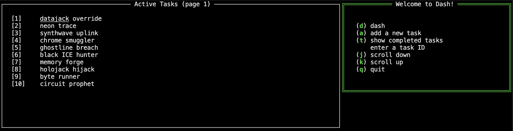

# Dash



Dash is a small terminal task dashboard backed by SQLite.

## Install

```sh
curl -fsSL https://github.com/raphael-p/datashard/releases/latest/download/install.sh | sh
```

This installs `datashard` in `~/.local/bin` and stores its data in `~/.dash`. Make sure
`~/.local/bin` is on your `PATH`.

## Usage

Start the dashboard:

```sh
datashard
```

Inside Dash:

- `a` — add a task
- `d` — delete a task
- `t` — show completed tasks
- `j` / `k` — scroll down / up
- `q` — quit

Command-line commands:

```sh
datashard init                         # initialise the database
datashard generate                     # add sample data
datashard generate -randomEntryCount 5 # add sample data and five random tasks
datashard wipe                         # delete all data, after confirmation
datashard extract --days 7             # export tasks completed in the last 7 days
datashard extract --since 2026-01-01   # export tasks completed since a date
```

Set `DASH_DATA_DIR` to use another data directory:

```sh
DASH_DATA_DIR=/path/to/data datashard
```
