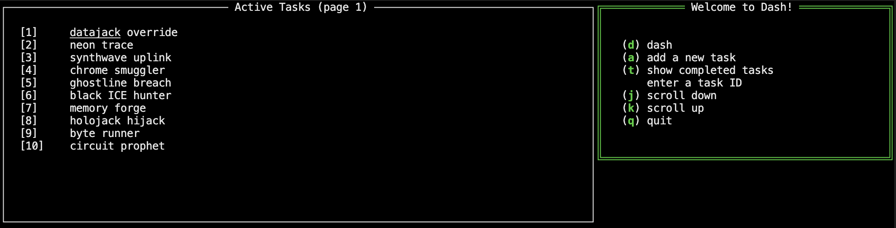

# Dash



Dash is a small terminal task dashboard backed by SQLite.

## Install

```sh
curl -fsSL https://github.com/raphael-p/dash/releases/latest/download/install.sh | sh
```

This installs `dsh` in `~/.local/bin` and stores its data in `~/.dash`. Make sure
`~/.local/bin` is on your `PATH`.

## Usage

Start the dashboard:

```sh
dsh
```

Command-line commands:

```sh
dsh init                         # initialise the database
dsh generate                     # add sample data
dsh generate -randomEntryCount 5 # add sample data and five random tasks
dsh wipe                         # delete all data, after confirmation
dsh extract --days 7             # export tasks completed in the last 7 days
dsh extract --since 2026-01-01   # export tasks completed since a date
```

Set `DASH_DATA_DIR` to use another data directory:

```sh
DASH_DATA_DIR=/path/to/data dsh
```

## Configuration

Configuration values are defined in `config.json` within the Dash data directory. By default, this file is located at `$HOME/.dash/config.json` and contains:

```json
{
    "dash_duration_seconds": 0,
    "description_char_limit": 0,   
    "name_char_limit": 25          
}
```

- `dash_duration_seconds`: duration of a dash in seconds, 25 minutes unless a non-zero value is specified
- `description_char_limit`: character limit for a task description, unlimited unless a non-zero value is specified
- `name_char_limit`: character limit for a task name

## Uninstall

Assuming default data and install directories:

⚠️ This will wipe your dash data ⚠️
```sh
rm -rf -- "$HOME/.dash" "$HOME/.local/bin/dsh"
```